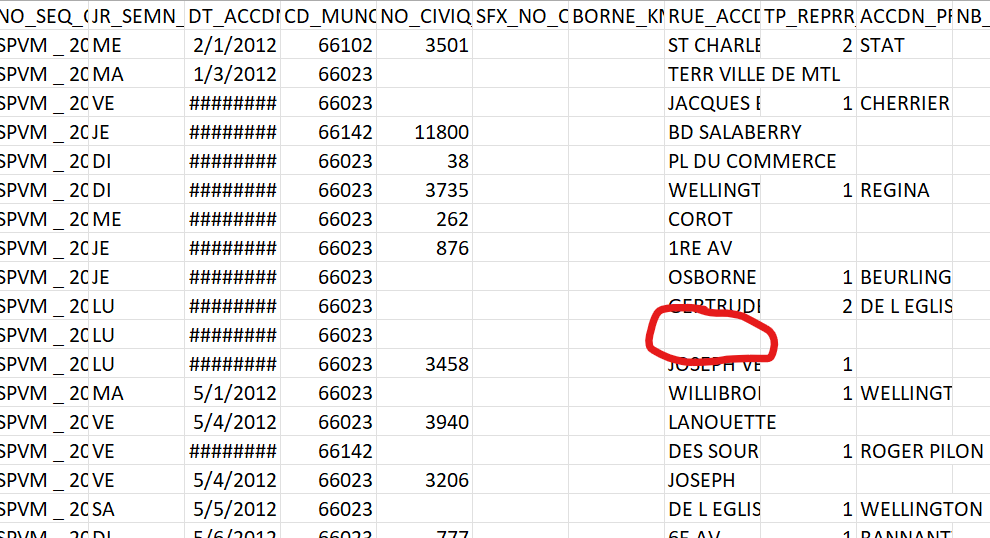

# Montreal Road Collision Analysis

## Background
I've always been fascinated by data science, more specifically, by how it allows us to feed some algorithm a bunch of information, then write some code to extract concrete, useful facts to help us enlarge our perspective and make better decisions.

When I was browsing through the Montreal open-data platform, [this](https://donnees.montreal.ca/ville-de-montreal/collisions-routieres) dataset caught my eye. Awesomely, folks working for the city have culminated over 10 full years of road collision data and made it public for everyone (thanks <3)! While reading through the rows and columns of data, I found the idea of my next project...

## Objectives
For this project, I want to do more than simply parsing all the collision info. So, I ended up setting myself three very specific objectives to achieve:

1. <b>Find the most dangerous road</b> (with the most collisions)
2. <b>Find the deadliest road</b> (with the most deadly collisions)
3. <b>Find the most dangerous hour on the roads</b> (with the most collisions)

## Methodology

Thankfully, the dataset provided by the city contains all the information I need to attain all of my objectives. I decided to use the Pandas library with Python, so the natural first step would be to generate a DataFrame using the CSV set file.
```python
df = pd.read_csv('data.csv')
```
Next, to find the most dangerous road, I'll need to use the `RUE_ACCDN` column containing the name of the road where the collision occured. Naturally, the data needs some cleaning up. In this case, I've noticed some rows have an empty value where the street name is supposed to be indicated.

I assume this is because the information wasn't provided, or the collision itself didn't occur on a public road. Anyhow, we'll simply drop such rows.
```python
df.dropna(subset = ['RUE_ACCDN'], inplace = True)
```
Now with a clean dataset, we can proceed to extract and analyze the desired data. The scripts are found in `collisionByDt.py` and `collisionBySt.py`.

To find out the most dangerous hour to drive, we'll instead need another data column- `HEURE_ACCDN`. To increase redability, I've decided to simplify the time format (Example:  `00:00:00-00:59:00` becomes `12AM-1AM`). The script for this objective is in `collisionByHr.py`

## Results

Using `matplotlib` to plot the data onto a bar chart, we can easily identify what we're looking for: 
### The most dangerous road in Montreal is...
<b>🚨 Rue Sherbrooke 🚨</b>
| Road name  | Collisions recorded | Ranking
| ------------- | ------------- | --- |
| SHERBROOKE  | 3835  | 🥇
| HENRI BOURASSA  | 3128  | 🥈
| PAPINEAU  | 2326  | 🥉
| JEAN TALON   | 2173  | 4
| SHERBROOKE E   | 1950  | 5
| N-D   | 1947  | 6
| ST LAURENT  | 1946  | 7
| PIE IX   | 1835  | 8
| DECARIE   | 1731  | 9
| ST DENIS  | 1635  | 10


<hr>


### The deadliest road in Montreal is...
<b>🚨 Rue St-Denis 🚨</b>
| Road name  | Deadly collisions recorded | Ranking
| ------------- | ------------- | --- |
| ST DENIS  | 8  | 🥇
| MAURICE DUPLESSIS   | 4  | 🥈
| AV DU PARC  | 4  | 🥈
| SHERBROOKE   | 4  | 🥈
| N-D    | 4  | 🥈
| HENRI BOURASSA    | 4  | 🥈
| LACORDAIRE   | 3  | 🥉
| BELANGER   | 3  | 🥉
| CREMAZIE   | 3  | 🥉
| HOCHELAGA   | 3  | 🥉


<hr>

### The most dangerous hour on the roads in Montreal is...
<b>🚨 4PM-5PM 🚨</b>
(and the safest is 4AM-5AM)

